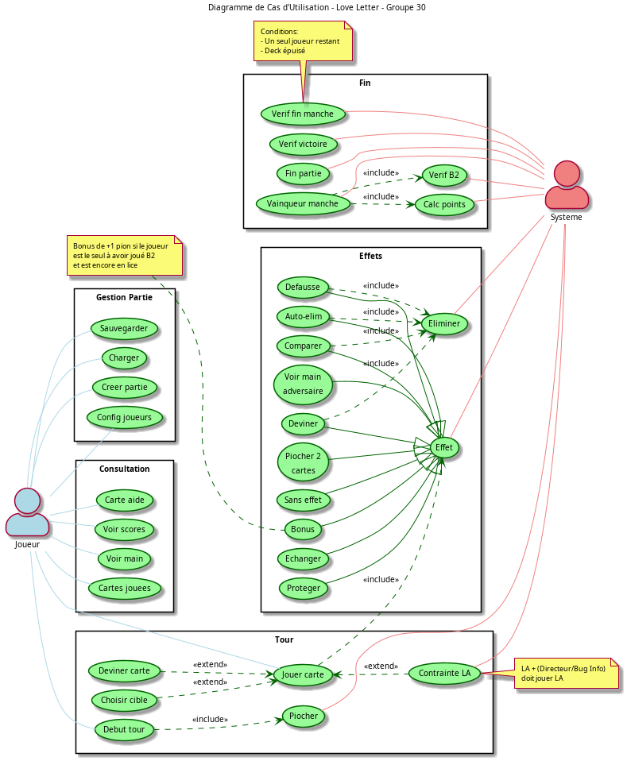
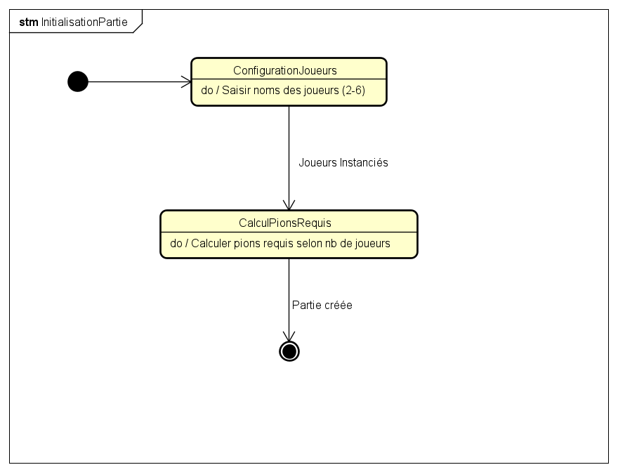
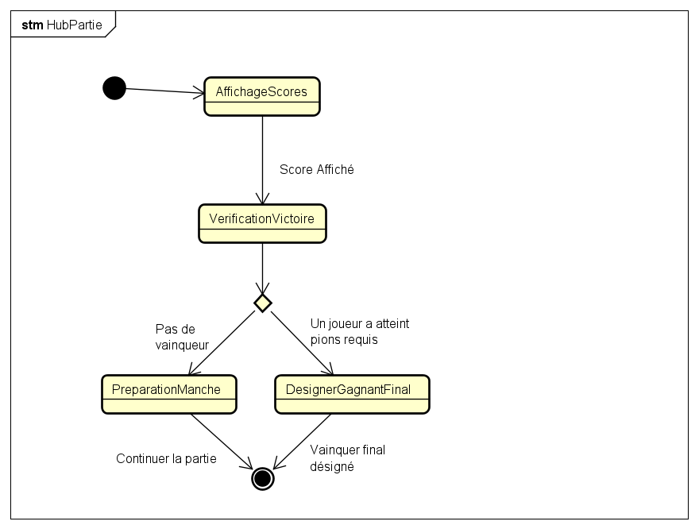
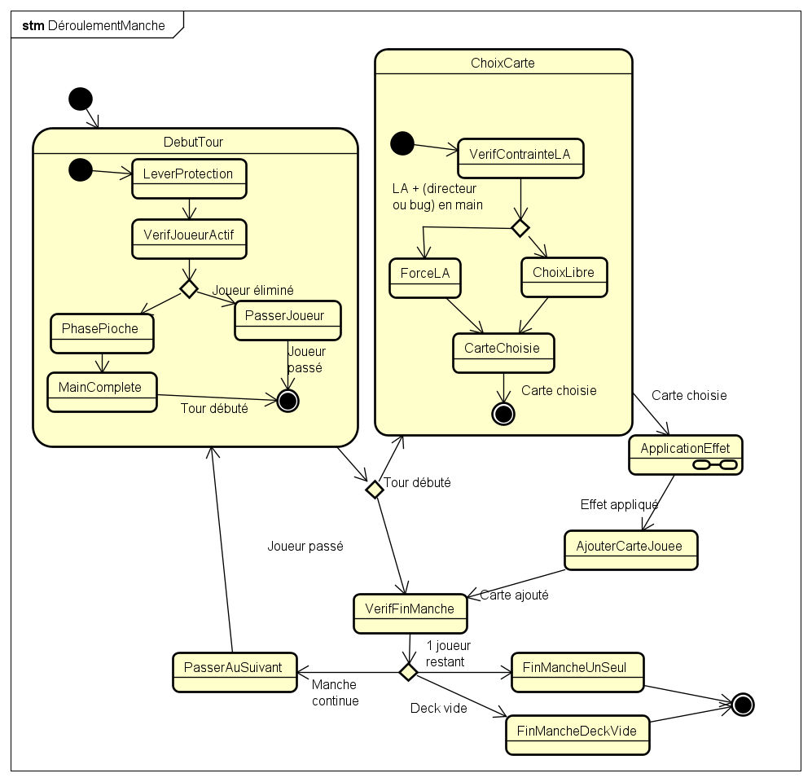

\newpage 

# Introduction

Ce rapport présente la structure de notre projet Love Letter adapté à l'univers de l'UTBM

Le rapport s'organise de la manière suivante :

- L'**adaptation thématique** du jeu à l'univers de l'UTBM, centrée sur la demande de Semestre d'Études à l'Étranger (SEE)
- Le **diagramme des cas d'utilisation**, qui décrit les interactions entre les utilisateurs et le système
- Le **diagramme de classes**, qui illustre l'architecture logicielle du projet
- Les **machines à états-transitions**, présentées dans un ordre "chronologique", qui modélisent le comportement dynamique du système

# Adaptation à l'univers de l'UTBM

## Contexte narratif

Notre version transpose Love Letter dans l'univers de l'UTBM. Les joueurs incarnent des étudiants tentant de valider leur dossier de Semestre d'Études à l'Étranger (SEE).

## Correspondance des cartes

Le tableau suivant présente la correspondance entre les cartes du jeu original et leur adaptation à l'univers UTBM :

| Valeur | Nom initial  | Adaptation UTBM                                    | Rôle dans le lore                                          |
|--------|--------------|----------------------------------------------------|------------------------------------------------------------|
| 9      | Princesse    | Gestionnaire SEE                                   | L'interlocuteur ultime qui valide ou refuse le dossier     |
| 8      | Comtesse     | LA (Learning Agreement)                           | Le contrat pédagogique qui définit votre programme d'études à l'étranger |
| 7      | Roi          | Directeur                                          | L'autorité suprême de l'établissement                      |
| 6      | Chancelier   | L'Ancien                                          | Un élève ayant déjà effectué un SEE dans cette destination |
| 5      | Prince       | Bug informatique                                   | Un imprévu technique qui peut tout bouleverser             |
| 4      | Servante     | Règlement des Études                              | Le cadre administratif à respecter impérativement          |
| 3      | Baron        | Le jury                                           | L'instance qui compare et évalue les candidatures          |
| 2      | Prêtre       | Tuteur pédagogique                                | Le conseiller qui vous guide dans vos démarches            |
| 1      | Garde        | Examen                                            | L'épreuve à surmonter pour avancer dans le processus       |
| 0      | Espionne     | B2 anglais                                        | Le prérequis linguistique indispensable et discret         |

\newpage

# Diagramme des cas d'utilisation

\newpage

# Diagramme de classes 

\newpage

# Machines à états-transitions

## Vue d'ensemble : Partie complète

Enchaînement : Initialisation → HubPartie (boucle de manches) → FinPartie.

\newpage

## Initialisation de la partie 

Configuration des joueurs (2-6) et calcul des pions requis pour la victoire.

\newpage

## Déroulement de la partie

### Hub central de la partie

Affichage des scores et vérification de victoire. Lance une nouvelle manche ou termine la partie.

\newpage

### Initialisation d'une manche

Création et mélange du deck, mise de côté d'une carte, distribution et détermination du premier joueur.

\newpage

### Déroulement d'une manche

Tour de jeu : vérifications initiales → pioche → choix de carte (avec contrainte LA si nécessaire) → application d'effet → vérification fin de manche.

**Note** : La sous-machine ApplicationEffet n'a pas été finalisée.

\newpage

### Fin de manche

Détermination du vainqueur (dernier en jeu ou carte la plus forte), attribution des pions et bonus B2 si applicable.

\newpage

## Fin de partie

Annonce du vainqueur et affichage des statistiques finales.

# Conclusion

Ce rapport présente la structure complète de notre implémentation de Love Letter adaptée à l'UTBM. La principale limitation est la sous-machine d'application des effets de cartes, non finalisée par contrainte de temps.