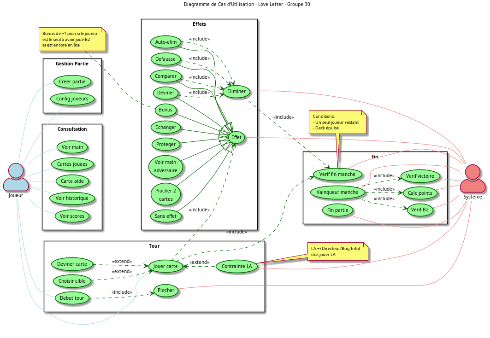
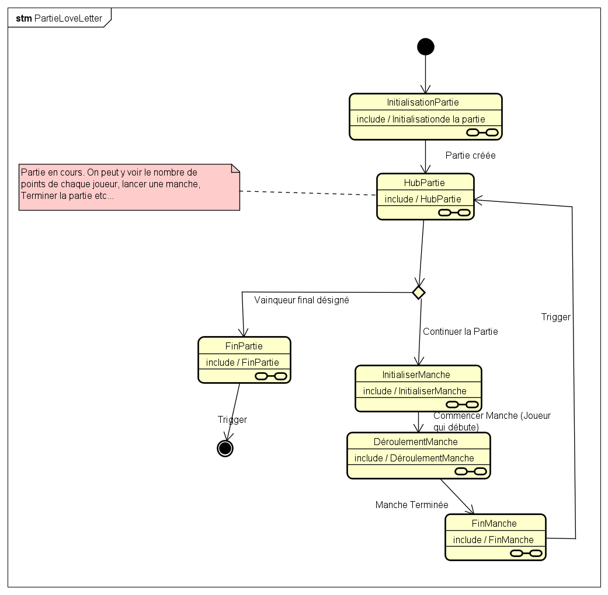
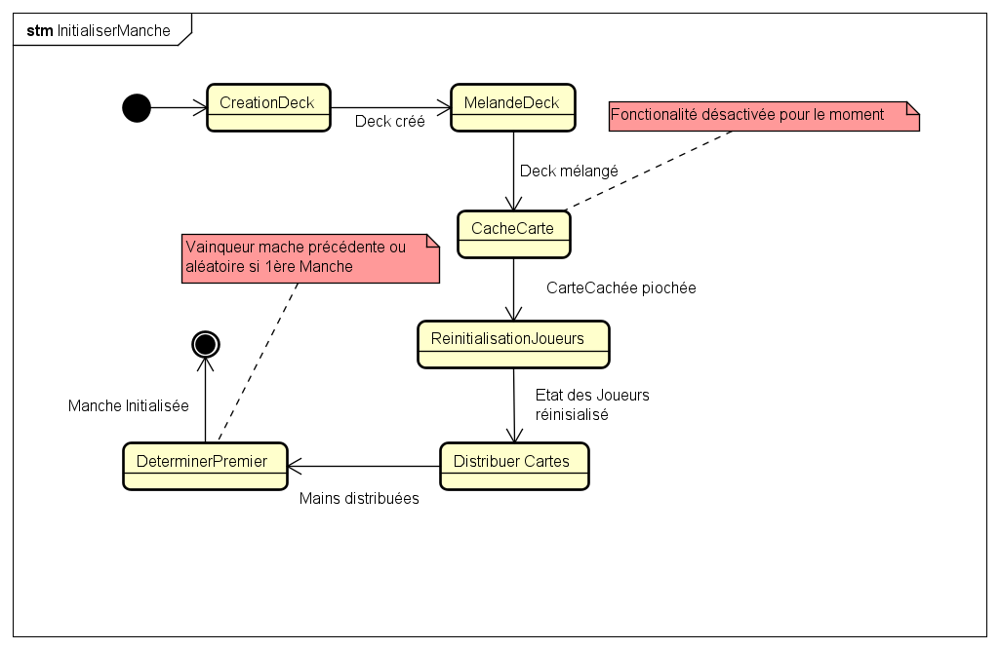
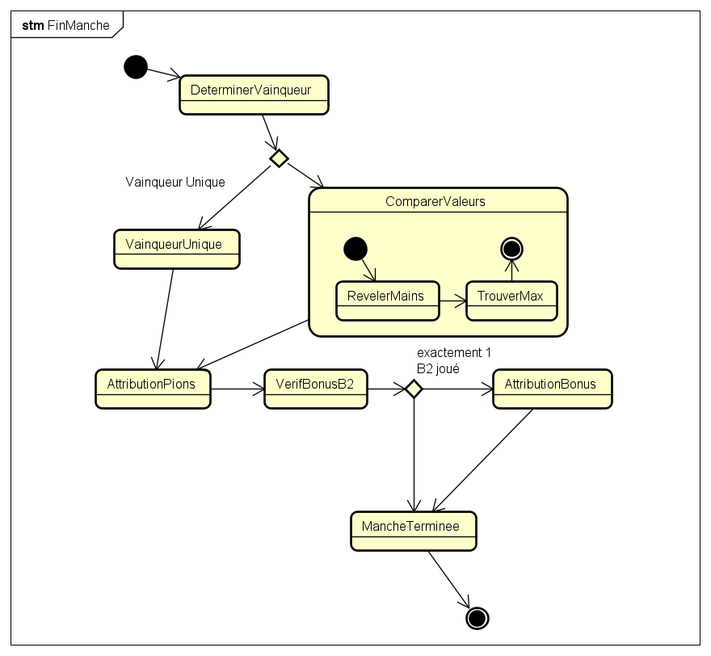
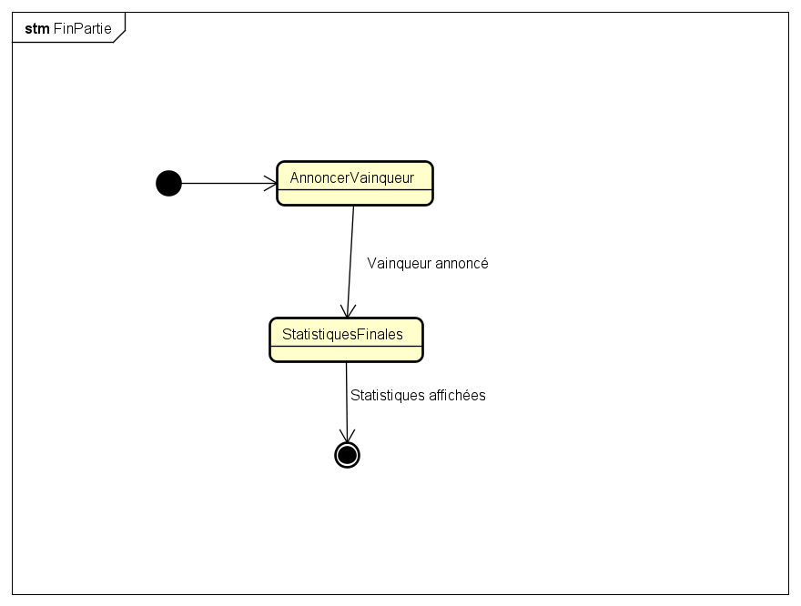

\newpage 

# Introduction

L'objectif de ce projet était de concevoir et développer une version numérique du célèbre jeu de cartes minimaliste "Love Letter" en utilisant le langage Java tout en modifiant le contexte du jeu pour l'adapter à l'univers de l'UTBM. Nous avons donc choisit de baser le jeu sur la demande de semestre d'étude à l'étrnager.

Ce rapport détaille notre démarche de conception, les choix architecturaux effectués (notamment l'adoption du patron MVC), ainsi que la modélisation UML qui a guidé notre développement.

\newpage

# Adaptation Thématique : "Objectif SEE"

Pour rendre le jeu plus immersif et pertinent pour notre public cible, nous avons transposé la quête romantique du jeu original (faire parvenir une lettre à la Princesse) en une quête académique : la validation d'un dossier de Semestre d'Études à l'Étranger (SEE).

## Contexte Narratif

Les joueurs incarnent des étudiants de l'UTBM naviguant à travers les méandres administratifs et pédagogiques de l'université. Chaque carte représente un acteur ou un événement clé de la vie étudiante, aidant ou entravant la progression du dossier vers la "Gestionnaire SEE" (l'équivalent de la Princesse).

## Correspondance des Cartes

Nous avons conservé l'équilibre mathématique du jeu original tout en réécrivant le "lore". Le tableau ci-dessous détaille cette adaptation :

| Valeur | Carte Originale | Adaptation UTBM | Rôle et Justification Thématique |
|:------:|-----------------|-----------------|----------------------------------|
| 9 | Princesse | Gestionnaire SEE | L'interlocuteur ultime. Si vous la "défaussez" (la froissez), votre dossier est perdu (élimination). |
| 8 | Comtesse | LA (Learning Agreement) | Le contrat pédagogique. Il est lourd à porter (doit être défaussé) si vous rencontrez le Directeur ou un Bug. |
| 7 | Roi | Directeur | L'autorité suprême. Il a le pouvoir de bouleverser la situation (échange de mains). |
| 6 | Chancelier | L'Ancien | Un étudiant expérimenté qui connaît les ficelles (permet de piocher et remettre sous le deck). |
| 5 | Prince | Bug Informatique | L'imprévu technique fatal qui force à tout recommencer (défausse de la main). |
| 4 | Servante | Règlement des Études | La protection absolue. En suivant le règlement à la lettre, on est intouchable pour un tour. |
| 3 | Baron | Le Jury | L'instance d'évaluation. Compare les dossiers (mains) et élimine le plus faible. |
| 2 | Prêtre | Tuteur Pédagogique | Il a un droit de regard sur votre dossier (permet de voir la main d'un autre). |
| 1 | Garde | Examen | L'épreuve courante. Permet de tester (deviner) le jeu d'un adversaire et potentiellement de l'éliminer. |
| 0 | Espionne | B2 Anglais | Le prérequis discret mais indispensable. Rapporte un bonus si joué stratégiquement. |

\newpage

# Conception et Architecture UML

Nous avons opté pour une approche rigoureuse basée sur la modélisation UML avant l'implémentation, garantissant une structure de code claire et maintenable.

## Diagramme des Cas d'Utilisation

Ce diagramme illustre les interactions possibles entre le Joueur et le Système. Il met en évidence la séparation entre la gestion globale de la partie (Configuration) et le déroulement d'un tour de jeu (Piocher, Jouer une carte, Appliquer un effet).

*Note : Le diagramme a été mis à jour pour refléter l'implémentation réelle (retrait des fonctionnalités de sauvegarde non implémentées).*

\newpage

## Diagramme de Classes et Structure des Données

L'architecture statique du projet repose sur plusieurs principes clés de la Programmation Orientée Objet :

1.  **Pattern Singleton (`Partie`)** : Garantit qu'une seule instance du jeu gère le cycle de vie global (scores, nombre de manches).
2.  **Composition (`Manche`, `Deck`, `Joueur`)** : Une `Partie` est composée de plusieurs `Manches`. Chaque `Manche` instancie son propre `Deck` et gère l'état des `Joueurs` (actifs, éliminés, protégés).
3.  **Héritage et Polymorphisme (`Carte`)** : La classe abstraite `Carte` définit le contrat commun (nom, valeur, méthode `appliquerEffet`). Les 10 types de cartes (ex: `Exam`, `Directeur`) héritent de cette classe et implémentent leur propre logique métier.
4.  **Encapsulation (`ActionJoueur`)** : Pour découpler le Contrôleur du Modèle, nous avons créé une classe `ActionJoueur` qui regroupe toutes les données d'un coup (joueur source, carte jouée, cible, devinette).

\newpage

# Modélisation Dynamique (Machines à États)

Pour capturer la complexité du flux de jeu, nous avons modélisé le comportement du système à l'aide de diagrammes d'états-transitions. Cette approche nous a permis de découper le problème en sous-systèmes gérables.

## Vue d'ensemble
Le diagramme global montre l'architecture de haut niveau de la boucle de jeu.

Le système fonctionne comme une machine à états hiérarchique : après l'initialisation, le jeu entre dans un "Hub" central qui orchestre les manches successives jusqu'à la fin de la partie.

\newpage

## Initialisation de la Partie
Cette phase configure les paramètres immuables de la session.

Le système instancie le Singleton `Partie`, enregistre les 2 à 6 joueurs, et détermine le nombre de "pions de faveur" requis pour la victoire (ex: 3 pions pour 5 joueurs).

\newpage

## Le Hub Central
C'est le cœur décisionnel entre les manches.

À la fin de chaque manche, le système revient à cet état pour :

1. Vérifier si un joueur a atteint le score cible.
2. Si oui, transitionner vers `FinPartie`.
3. Sinon, lancer une nouvelle manche (`InitialiserManche`).

\newpage

## Cycle de Vie d'une Manche

### Initialisation de la Manche

C'est ici que la logique de préparation est critique. Le deck est créé et mélangé, puis les mains sont distribuées à chaque joueur.

*Note : Dans la version actuelle, la règle de la "carte brûlée" (mise de côté face cachée) a été temporairement désactivée pour simplifier le gameplay. Cette fonctionnalité pourra être réactivée ultérieurement.*

\newpage

### Déroulement (Tour par Tour)

Ce diagramme détaille la boucle principale :

1. **Début de tour** : Le joueur actif perd sa protection (si active).
2. **Pioche** : Le joueur tire une carte.
3. **Action** : Le joueur choisit une carte à jouer.
4. **Effet** : L'effet de la carte est appliqué (élimination, échange, protection, etc.).
5. **Vérification** : Le système vérifie si la manche est terminée (deck vide ou survivant unique).

\newpage

### Fin de Manche

Le calcul des vainqueurs s'effectue ici. En cas d'égalité de valeur de main, la somme des cartes défaussées est utilisée pour départager. Les bonus (comme celui de la carte B2 Anglais) sont attribués avant le retour au Hub.

\newpage

## Fin de Partie

L'état final affiche le classement et permet de quitter ou de relancer une session.

\newpage

# Difficultés Rencontrées et Ajustements

Le passage de la conception théorique (UML) à l'implémentation pratique (Java) a révélé plusieurs défis techniques et logiques qui nous ont forcés à adapter notre approche.

## Incohérences dans le Diagramme d'États Initial
Une difficulté majeure a concerné l'ordre des opérations lors de l'initialisation des manches.

**Problème :**
Dans notre conception initiale (Diagramme ET), l'état de "Distribution des cartes" précédait parfois l'état de "Réinitialisation des joueurs" dans la boucle de jeu.
Concrètement, lors de l'implémentation, cela a provoqué un bug critique : les joueurs recevaient leurs cartes, puis la méthode `joueur.reinitialiser()` était appelée au début de la manche suivante, ce qui avait pour effet de vider leur main (`main.vider()`) et d'effacer les cartes qu'ils venaient de recevoir.

**Solution :**
Nous avons dû revoir la séquence d'initialisation dans la classe `Manche`. L'ordre strict implémenté est désormais :
1. Nettoyage complet des joueurs (statuts, mains, défausses).
2. Création et mélange du Deck.
3. Distribution des cartes.

## Gestion de la Complexité des Effets
Certaines cartes, comme le *Directeur* (échange de mains) ou le *Bug Informatique* (défausse forcée), ont posé des problèmes d'interaction. Par exemple, gérer le cas où un joueur se défausse du *Gestionnaire SEE* (Princesse) à cause d'un *Bug Informatique* a nécessité une gestion fine des exceptions et des conditions de victoire immédiate/défaite dans le modèle.

## Synchronisation Modèle-Vue
L'architecture MVC, bien que robuste, a complexifié la mise à jour de l'interface. Assurer que la vue se rafraîchit correctement après une action complexe (comme un échange de main entre deux joueurs) a nécessité une attention particulière sur le Contrôleur (`GameController`), qui agit comme chef d'orchestre.

## Ordre d'Exécution des Actions

**Problème :**
Dans un premier temps, nous procédions ainsi pour jouer un tour :
1. Enregistrer l'historique.
2. Vérifier si une cible est requise.
3. Si oui, vérifier si la cible est protégée.
4. Appliquer l'effet.
5. Retirer la carte de la main.

Avec cet ordre, des incohérences apparaissaient. Par exemple, avec la carte  `Directeur` (échange de mains), l'effet s'appliquait avant le retrait de la carte, ce qui entraînait des erreurs de duplication ou de persistance de la carte dans la main échangée. De même, cibler un joueur protégé empêchait parfois le retrait de la carte bien qu'elle ait été jouée.

**Solution :**
Nous avons corrigé l'algorithme pour retirer systématiquement la carte de la main du joueur avant d'appliquer son effet ou de vérifier les protections adverses.

\newpage

# Implémentation Technique

L'implémentation respecte strictement le patron de conception MVC (Modèle-Vue-Contrôleur).

## Le Modèle (Cœur Logique)
Le modèle est totalement indépendant de l'interface graphique. Il contient toute la logique métier et est couvert par une suite de tests unitaires (JUnit).

### Architecture Générale
Le modèle s'articule autour de deux classes maîtresses :
*   **`Partie` (Singleton)** : Point d'entrée principal, elle orchestre le cycle de vie global (lancement du jeu, transition entre les manches, persistance des joueurs). Le pattern Singleton garantit l'unicité de l'instance.
*   **`Manche`** : Si `Partie` gère la guerre, `Manche` gère la bataille. Elle contrôle la boucle de jeu séquentielle (tour des joueurs, pioche, conditions de fin).

### La Gestion des Actions : `ActionJoueur`
La classe `ActionJoueur` est un élément central de notre architecture. Elle agit comme un objet de transfert de données (DTO) qui encapsule l'intégralité de l'intention de jeu d'un utilisateur.
Plutôt que de passer de multiples paramètres disparates, on regroupe le tout : joueur source, carte jouée, cible éventuelle, et carte devinée (pour l'Examen). Cette encapsulation permet de découpler le Contrôleur du Modèle.

### Le Système de Cartes (Factory et Polymorphisme)
Le jeu repose sur un système extensible :
*   **`Carte` (Abstraite)** : Définit le contrat commun et force l'implémentation de `appliquerEffet()`.
*   **`CarteFactory`** : Utilise le pattern Factory pour centraliser la création des cartes et la configuration du deck, facilitant l'équilibrage.
*   **`MainJoueur`** : Gère la main du joueur et implémente notamment la règle critique du "Learning Agreement" (Comtesse) via `doitJouerLA()`.

## La Vue (Interface Utilisateur)
Développée en Java Swing, la vue est passive et se met à jour sur ordre du contrôleur.

### Fenêtre Principale et Panneaux
*   **`LoveLetterUI`** : La fenêtre principale héritant de JFrame.
*   **`PlateauPanel`** : Affiche en permanence les cartes jouées (historique visuel), la main du joueur actif et l'état de tous les joueurs (en jeu, protégé, éliminé).

### Les Dialogues
Les interactions spécifiques sont gérées via des fenêtres modales (`JDialog`) :
*   **Initialisation** : `InitPartieDialog` et `InitNomsDialog` pour configurer la partie.
*   **Actions de jeu** : Lorsqu'une carte nécessite de cibler un joueur ou de deviner une carte, une boîte de dialogue spécifique s'ouvre.
*   **Fin de manche** : Un dialogue récapitulatif affiche les vainqueurs et les scores.

## Le Contrôleur (`GameController`)
Véritable chef d'orchestre du projet, cette classe gère la boucle de jeu. Elle permet de :
*   Démarrer la partie et lancer les manches.
*   Définir le joueur actif.
*   Interpréter les actions des joueurs (clics boutons).
*   Appeler les méthodes du modèle (`jouerTour`).
*   Ordonner à la vue de se rafraîchir.

Le contrôleur fait le lien entre les événements Swing et la logique métier, s'assurant que l'interface reste réactive et cohérente avec l'état du modèle.

# Conclusion

Ce projet a permis de transformer une conception UML théorique en une application Java fonctionnelle. L'adaptation thématique à l'univers de l'UTBM ("Objectif SEE") ajoute une dimension ludique originale tout en conservant la mécanique mathématique précise du jeu Love Letter.

Bien que des difficultés aient été rencontrées, notamment sur la synchronisation des états lors des transitions de manche, l'architecture MVC mise en place offre une base solide. Le modèle est robuste et testé, et la séparation des responsabilités permettrait facilement d'ajouter de nouvelles fonctionnalités (comme un mode réseau) dans le futur.
